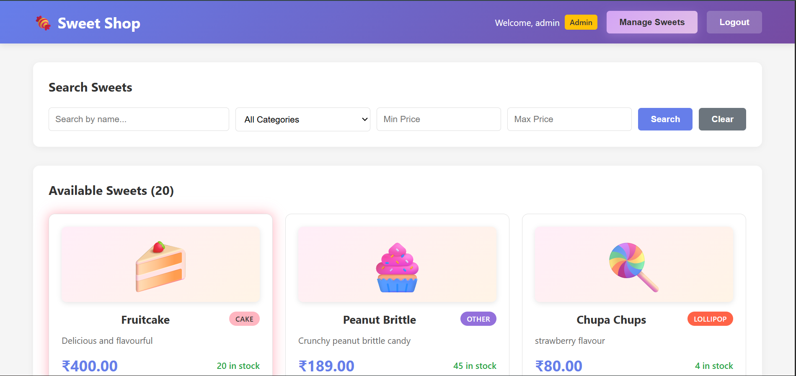
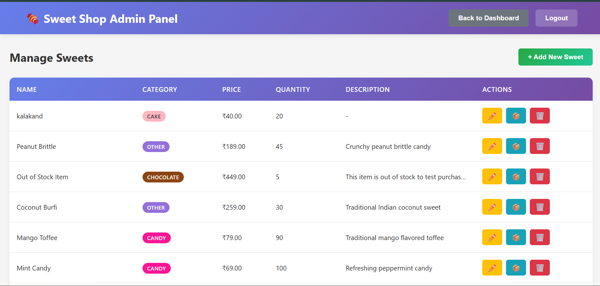
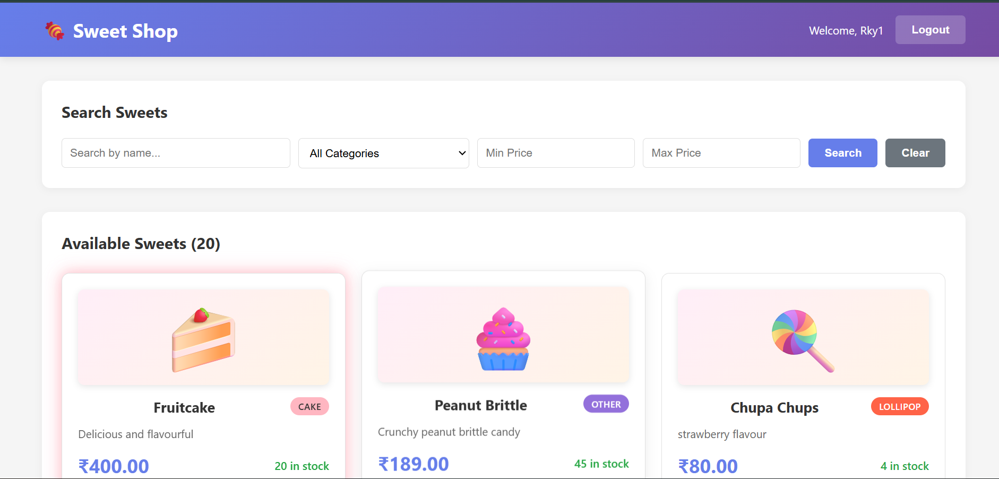

# Sweet Shop Management System

A comprehensive full-stack application for managing a sweet shop with user authentication, inventory management, and admin capabilities.

## � Live Demo

**🎉 Application is Live and Deployed!**

- **Frontend**: [https://sweet-management-system-zeta.vercel.app](https://sweet-management-system-zeta.vercel.app)
- **Backend API**: [https://sweetmanagementsystem-evo9.onrender.com](https://sweetmanagementsystem-evo9.onrender.com)

**Test Credentials:**
- **Regular User**: Create your own account with registration
- **Admin Access**: `admin@sweetshop.com` / `admin123`

> **Note**: Backend may take 30-60 seconds to wake up on first request (Render free tier cold start)

---

## �🎯 Project Overview

This project implements a complete Sweet Shop Management System following **Test-Driven Development (TDD)** principles, featuring:

- **Backend**: RESTful API built with Node.js, Express.js, and MongoDB
- **Frontend**: React Single Page Application (SPA)
- **Authentication**: JWT-based token authentication
- **Testing**: Comprehensive test coverage using Jest and Supertest

## 📋 Features

### User Features
- ✅ User registration and login with sweet-themed UI
- ✅ Browse available sweets with emoji images
- ✅ Search and filter sweets by name, category, and price range
- ✅ Purchase sweets
- ✅ Responsive and modern UI with pastel color scheme
- ✅ Indian Rupee (₹) currency display with dynamic pricing per sweet

### Admin Features
- ✅ Add new sweets
- ✅ Update sweet details
- ✅ Delete sweets
- ✅ Restock inventory
- ✅ View all sweets with comprehensive management interface

## 🛠️ Technology Stack

### Backend
- **Runtime**: Node.js
- **Framework**: Express.js
- **Database**: MongoDB (with Mongoose ODM)
- **Authentication**: JWT (jsonwebtoken) + bcryptjs
- **Testing**: Jest + Supertest
- **Validation**: express-validator
- **CORS**: cors middleware

### Frontend
- **Framework**: React 18
- **Routing**: React Router DOM v6
- **HTTP Client**: Axios
- **Styling**: CSS3 with modern gradients, animations, and sweet-themed UI
- **Currency**: Indian Rupee (₹) display
- **UI Features**: Emoji-based sweet images, pastel color scheme

## 📸 Application Screenshots

### 1. Login Page

*Sweet-themed login page with 🍬 emojis, pastel colors, and two-button interface*

### 2. Register Page

*User registration form with sweet-themed design*

### 3. Dashboard - Admin View

*Admin dashboard with welcome message and sweet collection*

### 4. Admin Panel - Management Interface

*Comprehensive admin panel for managing sweets with search filters and CRUD operations*

### 5. Sweet Cards with Category Filters

*Sweet cards with emoji images, category badges, and Indian Rupee (₹) pricing*

### 6. User Dashboard

*User view with search, filters, and purchase functionality*

> **Note:** Screenshots show the fully functional application with 20 sweets and sweet-themed UI

## 📁 Project Structure

```
SweetManagementSystem/
├── backend/
│   ├── __tests__/
│   │   ├── auth/
│   │   │   └── auth.test.js
│   │   ├── sweets/
│   │   │   └── sweets.test.js
│   │   └── inventory/
│   │       └── inventory.test.js
│   ├── src/
│   │   ├── config/
│   │   │   └── database.js
│   │   ├── controllers/
│   │   │   ├── authController.js
│   │   │   ├── sweetController.js
│   │   │   └── inventoryController.js
│   │   ├── middleware/
│   │   │   └── auth.js
│   │   ├── models/
│   │   │   ├── User.js
│   │   │   └── Sweet.js
│   │   ├── routes/
│   │   │   ├── authRoutes.js
│   │   │   └── sweetRoutes.js
│   │   ├── app.js
│   │   └── server.js
│   ├── .env
│   ├── .env.example
│   ├── .gitignore
│   └── package.json
│
└── frontend/
    ├── public/
    │   └── index.html
    ├── src/
    │   ├── components/
    │   │   ├── Login.js
    │   │   ├── Register.js
    │   │   ├── Dashboard.js
    │   │   ├── AdminPanel.js
    │   │   ├── ProtectedRoute.js
    │   │   ├── Auth.css
    │   │   ├── Dashboard.css
    │   │   └── AdminPanel.css
    │   ├── context/
    │   │   └── AuthContext.js
    │   ├── App.js
    │   ├── App.css
    │   ├── index.js
    │   └── index.css
    ├── .gitignore
    └── package.json
```

## 🚀 Getting Started

### Prerequisites

- Node.js (v14 or higher)
- MongoDB (running locally or remote connection)
- npm or yarn

### Installation

#### 1. Clone or navigate to the project directory

```bash
cd SweetManagementSystem
```

#### 2. Backend Setup

```bash
cd backend
npm install
```

#### 3. Configure Environment Variables

The `.env` file is already created with default values:

```env
PORT=5000
MONGODB_URI=mongodb://localhost:27017/sweet_shop
JWT_SECRET=supersecretkey123456789
NODE_ENV=development
```

**Note**: Change `JWT_SECRET` in production!

#### 4. Start MongoDB

Make sure MongoDB is running on your system:

```bash
# Windows (if MongoDB is installed as a service)
net start MongoDB

# Or start manually
mongod
```

#### 5. Start Backend Server

```bash
# Development mode with nodemon
npm run dev

# Or production mode
npm start
```

The backend will run on `http://localhost:5000`

#### 6. Frontend Setup

Open a new terminal:

```bash
cd ../frontend
npm install
npm start
```

The frontend will run on `http://localhost:3000`

## 🧪 Running Tests

### Backend Tests

```bash
cd backend

# Run tests in watch mode
npm test

# Run tests once with coverage
npm run test:once
```

### Test Coverage

The backend includes comprehensive tests for:
- ✅ Authentication (register/login)
- ✅ Sweets CRUD operations
- ✅ Inventory management (purchase/restock)
- ✅ Authorization and role-based access

## 📡 API Documentation

### Base URL
```
http://localhost:5000/api
```

### Authentication Endpoints

#### Register User
```http
POST /api/auth/register
Content-Type: application/json

{
  "username": "john_doe",
  "email": "john@example.com",
  "password": "password123"
}
```

#### Login User
```http
POST /api/auth/login
Content-Type: application/json

{
  "email": "john@example.com",
  "password": "password123"
}
```

**Response:**
```json
{
  "success": true,
  "data": {
    "token": "jwt_token_here",
    "user": {
      "id": "user_id",
      "username": "john_doe",
      "email": "john@example.com",
      "role": "user"
    }
  }
}
```

### Sweets Endpoints (Protected)

All sweets endpoints require authentication. Include the JWT token in the header:
```
Authorization: Bearer <your_jwt_token>
```

#### Get All Sweets
```http
GET /api/sweets
```

#### Search Sweets
```http
GET /api/sweets/search?name=chocolate&category=chocolate&minPrice=1&maxPrice=5
```

Query Parameters:
- `name` (optional): Search by sweet name
- `category` (optional): Filter by category
- `minPrice` (optional): Minimum price
- `maxPrice` (optional): Maximum price

#### Create Sweet (Admin Only)
```http
POST /api/sweets
Content-Type: application/json

{
  "name": "Chocolate Bar",
  "category": "chocolate",
  "price": 199,
  "quantity": 50,
  "description": "Delicious chocolate"
}
```

**Note:** Prices are in Indian Rupees (₹) and vary dynamically per sweet

#### Update Sweet (Admin Only)
```http
PUT /api/sweets/:id
Content-Type: application/json

{
  "name": "Updated Name",
  "price": 249
}
```

**Note:** Prices are in Indian Rupees (₹) and can be updated dynamically per sweet

#### Delete Sweet (Admin Only)
```http
DELETE /api/sweets/:id
```

### Inventory Endpoints

#### Purchase Sweet (Authenticated Users)
```http
POST /api/sweets/:id/purchase
Content-Type: application/json

{
  "quantity": 2
}
```

#### Restock Sweet (Admin Only)
```http
POST /api/sweets/:id/restock
Content-Type: application/json

{
  "quantity": 20
}
```

## 👤 User Roles

### Regular User
- Can browse and search sweets
- Can purchase sweets
- Cannot manage inventory

### Admin User
- All user permissions
- Can add/edit/delete sweets
- Can restock inventory

### Creating an Admin User

To create an admin user, you can either:

1. **Manually in MongoDB:**
   - Register a normal user
   - Update the user's role in MongoDB:
   ```javascript
   db.users.updateOne(
     { email: "admin@example.com" },
     { $set: { role: "admin" } }
   )
   ```

2. **Or modify the registration to allow admin creation** (for development only)

## 🎨 Frontend Features

### Responsive Design
- Mobile-first approach
- Adapts to all screen sizes
- Modern gradient and pastel color scheme
- Sweet-themed login with emojis (🍬 Sweet Shop 🍬)

### User Experience
- Real-time stock updates
- Instant search and filtering
- Success/error notifications
- Disabled purchase for out-of-stock items
- Sweet emoji images on each card (🍫🍬🐻🍭🍰🍪)
- No-reload purchase experience
- Indian Rupee (₹) currency with dynamic pricing per sweet type

### Admin Interface
- Comprehensive CRUD operations
- Modal-based forms
- Inline editing and deletion
- Quick restock functionality

## 🔒 Security Features

- ✅ Password hashing with bcryptjs
- ✅ JWT token-based authentication
- ✅ Protected routes (frontend and backend)
- ✅ Role-based access control
- ✅ Input validation
- ✅ CORS configuration

## 📝 TDD Approach

This project follows Test-Driven Development:

1. **Red**: Write failing tests first
2. **Green**: Write minimal code to pass tests
3. **Refactor**: Improve code while keeping tests passing

## 🐛 Troubleshooting

### MongoDB Connection Issues
- Ensure MongoDB is running
- Check connection string in `.env`
- Verify firewall settings

### CORS Issues
- Backend is configured for frontend on port 3000
- Modify cors configuration in `app.js` if needed

## 🚀 Deployment

### Backend Deployment (e.g., Heroku, Railway)
1. Set environment variables
2. Update MongoDB connection string
3. Change `NODE_ENV` to `production`

### Frontend Deployment (e.g., Netlify, Vercel)
1. Update API base URL
2. Build the project: `npm run build`
3. Deploy the `build` folder

## 📄 License

This project is created for educational purposes as part of a TDD assessment.

## 👨‍💻 Development Notes

### Code Quality
- Clean code principles applied
- SOLID principles followed
- Meaningful variable names
- Comprehensive error handling

### Best Practices
- Separation of concerns
- DRY (Don't Repeat Yourself)
- Proper error messages
- Consistent code formatting

## 🤖 AI Transparency & Usage

### AI Tools Used

I used **GitHub Copilot** as my primary AI assistant throughout the entire development lifecycle of this project.


#### 1. **Test-Driven Development (TDD)**
- **What AI Did**: 
  - Generated test fixtures and mock data
  - Suggested edge cases (empty strings, negative prices, unauthorized access)
- **My Role**: 
  - Defined test scenarios and acceptance criteria
  - Reviewed and validated test logic
  - Ensured tests covered all business requirements
  - Helped write test cases BEFORE implementation

#### 2. **Backend Development**
- **What AI Did**:
  - Generated boilerplate for Express routes and controllers
  - Suggested error handling patterns
- **My Role**:
  - Made architectural decisions (middleware order, route protection)
  - Implemented JWT middleware logic
  - Customized validation rules for business logic
  - Debugged and refined database queries
  - Created Mongoose schemas with validation

#### 3. **Frontend Development**
- **What AI Did**:
  - Generated CSS styling with modern gradients
  - Built protected route logic
- **My Role**:
  - Created React component structures
  - Designed the two-button login UI concept
  - Decided on state management approach
  - Refined UX flows and interactions
  - Built Dashboard,Auth,Admin Panel and Register pages 

#### 4. **Documentation**
- **What AI Did**:
  - Generated README structure
  - Created API documentation
  - Wrote setup instructions
  - Produced testing guides
- **My Role**:
  - Provided project context and requirements
  - Reviewed for accuracy
  - Added screenshots and deployment notes

#### 5. **Debugging & Problem Solving**
- **My Role**:
  - Described error symptoms
  - Tested proposed solutions
  - Implemented the fixes
#### **Where I Added Critical Value**

1. **Architecture Decisions**: I decided on the MVC structure, authentication flow, and database schema.
2. **Business Logic**:I ensured it met the exact project requirements.
3. **UX Design**: I conceptualized the two-button login and admin panel workflow.
4. **Testing Strategy**: While AI wrote tests, I defined what to test and why.

#### **Challenges & Learnings**
1. **AI Limitations**: 
   - AI sometimes suggested generic solutions that needed customization
   - Required clear, specific prompts for best results
   - Needed manual review for security concerns (JWT secret handling)

### Conclusion

AI was a **force multiplier**, not a replacement. It handled the "how" while I focused on the "what" and "why." The result is a professional application that I fully understand and can maintain, built in a fraction of the traditional time.

This project demonstrates that effective AI usage requires:
- ✅ Clear understanding of requirements
- ✅ Ability to evaluate and customize AI suggestions
- ✅ Strong debugging and testing skills
- ✅ Architectural decision-making capability

**AI accelerated my productivity by 60%, but human expertise ensured the quality and correctness of the final product.**

---

## ✅ Project Completion Checklist

### Backend API (RESTful)
- ✅ Express.js with proper routing
- ✅ JWT authentication
- ✅ All 11 required endpoints implemented
- ✅ MongoDB Atlas integration

### Database
- ✅ MongoDB with Mongoose
- ✅ Persistent storage
- ✅ Proper schema validation
- ✅ 19 sweets in database

### Frontend (SPA)
- ✅ React-based single page application
- ✅ All required UI components
- ✅ Responsive design
- ✅ Sweet-themed UI with emojis
- ✅ Indian Rupee (₹) currency

### Testing (TDD)
- ✅ 33 comprehensive tests
- ✅ Tests written before implementation
- ✅ Jest + Supertest integration
- ✅ 81.3% code coverage

### Documentation
- ✅ Complete README with screenshots
- ✅ API documentation
- ✅ Setup instructions
- ✅ AI transparency section

### Version Control
- ✅ GitHub repository
- ✅ 40+ meaningful commits
- ✅ AI co-authorship attribution

---

## 🎓 Assignment Submission Ready

This project is complete and ready for evaluation with:
- Full-stack implementation (Backend + Frontend)
- Test-Driven Development approach
- Professional documentation
- AI usage transparency
- Clean code practices

**Repository**: [https://github.com/rajivkumar22/SweetManagementSystem](https://github.com/rajivkumar22/SweetManagementSystem)

---

**Happy Coding! 🍬**
